# Component

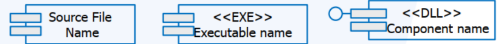

- Một phần không tầm thường của hệ thống, gần như độc lập và có thể thay thế được, giữ một chức năng rõ ràng trong hệ thống 

- Một component có thể là:
    - Một source code component
        - Là các class, interface, hoặc module/package trong mã nguồn.

        - Nhóm lại theo chức năng riêng biệt.

        - Dễ thay thế hoặc tái sử dụng.

        ```java
        // PaymentService.java (interface - defines contract)
        public interface PaymentService {
            void pay(double amount);
        }

        // PaypalPaymentService.java (one implementation)
        public class PaypalPaymentService implements PaymentService {
            public void pay(double amount) {
                System.out.println("Paying $" + amount + " via PayPal");
            }
        }

        // StripePaymentService.java (another implementation)
        public class StripePaymentService implements PaymentService {
            public void pay(double amount) {
                System.out.println("Paying $" + amount + " via Stripe");
            }
        }
        ```

    - Một run time components hoặc
        - Là một đối tượng/bean đang sống trong bộ nhớ khi chương trình chạy.

        - Ví dụ như một Spring Bean hoặc một Singleton Service đang hoạt động.

        ```java
        // MainApp.java
        public class MainApp {
            public static void main(String[] args) {
                PaymentService service = new PaypalPaymentService(); // runtime component
                service.pay(100.0);
            }
        }
        ```

    - Một executable component
        - Là thành phần đã được biên dịch và đóng gói, sẵn sàng chạy hoặc triển khai.

        - Ví dụ như file .jar, .war, hoặc ứng dụng .exe.
            - Giả sử bạn có toàn bộ code Java đã viết ở trên, và bạn biên dịch nó thành một file .jar

            ```java
            javac *.java
            jar cf payment-component.jar *.class
            ```

# PACKAGE
- Một package là một cơ chế để tổ chức các phần tử vào thành các nhóm 
    - Package giúp nhóm các class, interface, enum, v.v. có liên quan lại với nhau theo chức năng, module, hoặc domain.

    - Giúp tránh xung đột tên (namespace) và quản lý mã nguồn dễ dàng hơn.

    - Là công cụ để tổ chức mô hình hướng đối tượng theo cách rõ ràng và logic.

    - Ví dụ:
        - Lớp User nằm trong package com.myapp.user, tức là thuộc module quản lý người dùng.

        ```java
        package com.myapp.user;

        public class User {
            private String name;
            private String email;
            // constructor, getters, setters...
        }
        ```
    
- Một phần tử trong mô hình có thể chứa các phần tử khác
    - Trong thiết kế hướng đối tượng hoặc UML, package có thể chứa các class, interface, thậm chí package con.

    - Điều này phản ánh nguyên tắc tổ chức có phân cấp – mỗi phần có thể gói ghém logic nhỏ hơn bên trong.

    - Ví dụ UML:

        - package user chứa User, UserRepository, UserService

        - package order chứa Order, OrderService, Invoice

### Nguyên tắc OO – Tính đơn thể (Encapsulation / Modularity)
- Package hỗ trợ tính đơn thể bằng cách:

    - Che giấu chi tiết triển khai (class private, protected)

    - Cung cấp giao diện công khai (public API)

- Giúp giới hạn quyền truy cập giữa các phần tử trong cùng package hoặc từ bên ngoài.

- Java hỗ trợ mức truy cập default (package-private): class chỉ truy cập được trong cùng package.

### Dùng để
- Tổ chwucs mô hình đang phát triển

- Một đơn vị trong quản trị cấu hình

# SUB-SYSTEM

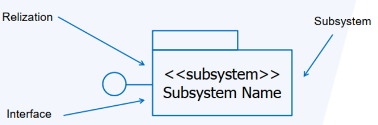

- Tổ hợp của một package (có thể chứa các phần tử khác trong mô hình) và một class (có hành vi)

- Hiện thực hóa một hoặc nhiều interface định nghĩa cho hành vi của nó

# RELATIONSHIP
- Trong lập trình hướng đối tượng (OOP), các mối quan hệ giữa các class phản ánh cách các đối tượng tương tác và phụ thuộc vào nhau.

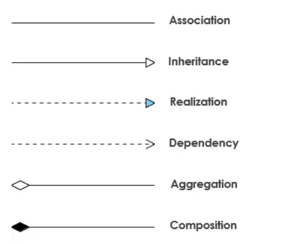

## ASSOCIATION – KẾT HỢP

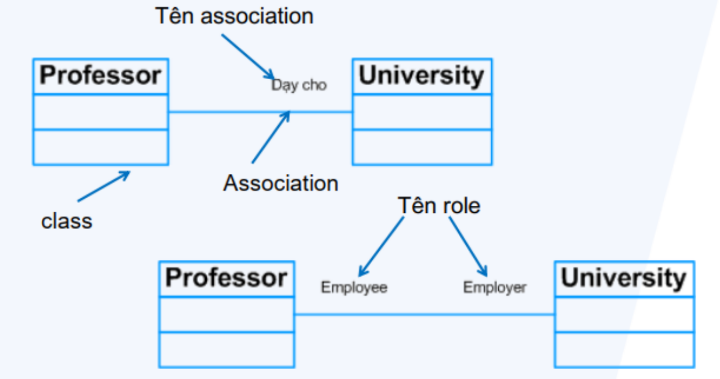


- Định nghĩa:
    - Mối quan hệ ngữ nghĩa giữa hai class.

    - Một class này biết về sự tồn tại hoặc có thể sử dụng một class khác.

    - Không có ràng buộc sở hữu. Quan hệ có thể là:

        - 1-1: một đối tượng liên kết với đúng một đối tượng khác.

        - 1-n: một đối tượng liên kết với nhiều đối tượng.

        - n-n: nhiều đối tượng liên kết qua lại.

- VÍ dụ thực tế
    - Một Giáo viên (Teacher) có thể dạy nhiều Học sinh (Student).

    - Một Student cũng có thể học nhiều Teacher.

```java
class Student {
    private String name;
    public Student(String name) {
        this.name = name;
    }
}

class Teacher {
    private String name;
    private List<Student> students;

    public Teacher(String name) {
        this.name = name;
        students = new ArrayList<>();
    }

    public void addStudent(Student student) {
        students.add(student);
    }
}
```

## AGGREGATION - THU NẠP

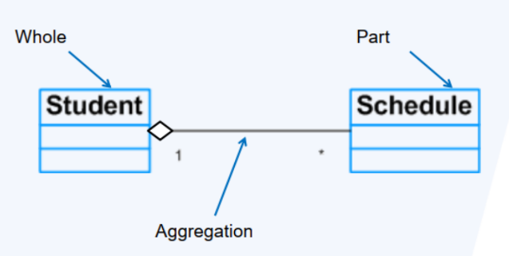

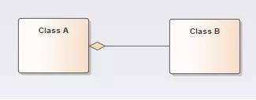

- Định nghĩa:
    - Là một dạng đặc biệt của Association, mang tính "toàn thể - bộ phận".

    - Bộ phận có thể sống độc lập với toàn thể.

    - Không có vòng đời chung: khi toàn thể bị hủy, bộ phận vẫn sống.

- Ví dụ thực tế:
    - Một Trường Đại học có nhiều Khoa.

    - Nếu trường đóng cửa, các khoa vẫn có thể được chuyển sang trường khác.

```java
class Department {
    private String name;
    public Department(String name) {
        this.name = name;
    }
}

class University {
    private List<Department> departments = new ArrayList<>();

    public void addDepartment(Department d) {
        departments.add(d);
    }
}
```

## COMPOSITION – CẤU THÀNH

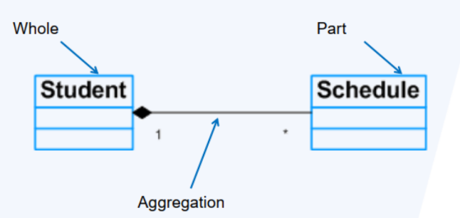

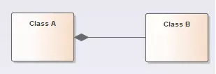

- Định nghĩa:
    - Là dạng mạnh hơn của Aggregation, mang tính sở hữu cao.

    - Vòng đời của bộ phận phụ thuộc hoàn toàn vào toàn thể.

    - Khi toàn thể bị hủy, các bộ phận cũng bị hủy theo.

- Ví dụ thực tế:
    - Một Ngôi nhà (House) có các Phòng (Room).

    - Nếu ngôi nhà bị phá, các phòng cũng biến mất.

```java
class Room {
    private String type;
    public Room(String type) {
        this.type = type;
    }
}

class House {
    private List<Room> rooms = new ArrayList<>();

    public House() {
        rooms.add(new Room("Living Room"));
        rooms.add(new Room("Bedroom"));
    }
}
```

## DEPENDENCY – PHỤ THUỘC

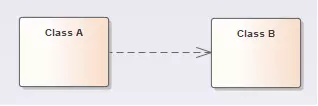

- Định nghĩa:
    - Một class tạm thời sử dụng một class khác.

    - Quan hệ này là lỏng lẻo nhất – không sở hữu, không vòng đời chung.

    - Chủ yếu xảy ra khi:

        - Một class dùng class khác làm tham số truyền vào.

        - Gọi phương thức của class khác.

        - Tạo tạm đối tượng trong method.

- Ví dụ thực tế:
    - Một Printer in báo cáo khi được yêu cầu bởi ReportGenerator.

```java
class Printer {
    public void print(String document) {
        System.out.println("Printing: " + document);
    }
}

class ReportGenerator {
    public void generate(Printer printer) {
        printer.print("Monthly Report");
    }
}
```

## GENERALIZATION – TỔNG QUÁT HÓA (KẾ THỪA)

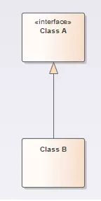

- Định nghĩa:
    - Mối quan hệ cha – con giữa các class.

    - Class con kế thừa thuộc tính/hành vi từ class cha.

    - Có thể ghi đè (override) hành vi nếu cần.

- Lưu ý: Java hỗ trợ đơn kế thừa (mỗi class chỉ kế thừa một class cha)

- Ví dụ thực tế:
    - Chó là một loại Động vật.

```java
class Animal {
    public void speak() {
        System.out.println("Animal speaks");
    }
}

class Dog extends Animal {
    @Override
    public void speak() {
        System.out.println("Dog barks");
    }
}
```

## REALIZATION – HIỆN THỰC HÓA (INTERFACE IMPLEMENTATION)

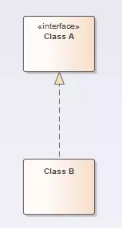

- Định nghĩa:
    - Là quan hệ giữa interface và class triển khai nó.

    - Class cam kết hiện thực mọi phương thức được định nghĩa trong interface.

    - Có thể xem là một dạng “kế thừa theo hợp đồng”.

- Ví dụ thực tế:
    - Interface Payment, class PaypalPayment là một hình thức thanh toán cụ thể.

```java
interface Payment {
    void pay(int amount);
}

class PaypalPayment implements Payment {
    public void pay(int amount) {
        System.out.println("Paying " + amount + " via PayPal.");
    }
}
```