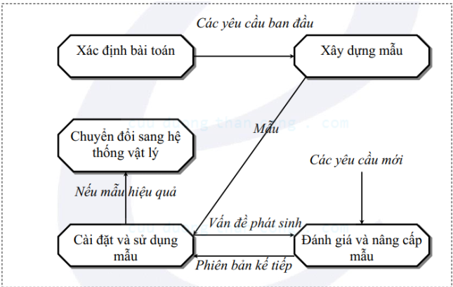

# Khảo sát và phân tích hiện trạng

## Mục tiêu:
- Khảo sát hiện trạng và xác lập dự án là giai đoạn đầu của quá trình phân tích và thiết kế hệ thống

- Mục tiêu:
    - Tiếp cận với nghiệp vụ chuyên môn, môi trường của hệ thống

    - Tìm hiểu vai trò, chức năng, nhiệm vụ và cách thức hoạt động của hệ thống

    - Nêu ra được các điểm hạn chế, bất cập của hệ thống cần phải thay đổi

    - Đưa ra được những vấn đề của hệ thống cần phải được nghiên cứu thay đổi.
    
- Mô tả hệ thống bằng văn bản (đặc tả), đề xuất ra phương án
thực hiện, cuối cùng là ký được một hợp đồng và hình thành 1 dự
án mang tính khả thi

- Tài liệu đặc tả các yêu cầu nhằm:
    - Làm cơ sở để trao đổi với người sử dụng và thảo luận giữa các nhóm thành viên trong dự án.

    - Làm căn cứ cơ bản cho các bước tiếp theo.

- Bao gồm các bước:
    - Xác định phạm vi bài toán (Domain Understanding)

    - Nắm bắt yêu cầu (Requirement Capture)

    - Phân loại và thẩm định yêu cầu (Classification and Validation)

    - Nghiên cứu tính khả thi (Feasibility Study)

## Quá trình khảo sát
- Việc khảo sát thường được tiến hành qua 2 giai đoạn:
    - Khảo sát sơ bộ nhằm xác định tính khả thi của dự án.

    - Khảo sát chi tiết nhằm xác định chính xác những gì sẽ thực hiện và khẳng định những lợi ích kèm theo.

## Các yêu cầu của việc khảo sát
- Khảo sát, tìm hiểu, đánh giá sự hoạt động của hệ thống cũ.

- Đề xuất các yêu cầu, các mục tiêu và các ưu tiên giải quyết cho hệ thống mới.

- Phác hoạ giải pháp mới và cân nhắc tính khả thi của dự án.

- Lập kế hoạch cho dự án cùng với các dự trù tổng quát.

## Nội dung khảo sát
- Các mục tiêu hoạt động của đơn vị, chiến lược, công việc thực hiện để đạt mục tiêu.

- Thông tin về nguồn dữ liệu bên trong và bên ngoài (định nghĩa, nội dung, dung lượng, kích thước):
    - Các hồ sơ, sổ sách, tập tin

    - Biểu mẫu, báo cáo, qui tắc, quy định, công thức

    - Các qui tắc, qui định ràng buộc lên dữ liệu

    - Các sự kiện tác động lên dữ liệu khi nó xảy ra

- Thu thập các chứng từ giao dịch và mô tả các chu trình lưu chuyển và xử lý thông tin và tài liệu giao dịch. Các mô tả khi nào, như thế nào, và bởi ai mà các dữ liệu đó được tạo ra, di chuyển, biến đổi và được lưu trữ bao gồm
    - Phương pháp: cách thức thực hiện

    - Tần suất: số lần thực hiện trong một đơn vị thời gian

    - Khối lượng: độ lớn thông tin thực hiện

    - Độ phức tạp

    - Độ chính xác: độ chính xác của kết quả thực hiện

    - Thứ tự và các phụ thuộc khác giữa các hoạt động truy xuất dữ liệu khác nhau

- Các chính sách, hướng dẫn mô tả hoạt động quản lý, thị trường và môi trường hệ thống

- Các phương tiện, tài nguyên có thể sử dụng (phần cứng, phần mềm, trang thiết bị,…)

- Trình độ chuyên môn sử dụng vi tính của các đối tượng xử lý thông tin

- Các đánh giá, phàn nàn về hệ thống hiện tại, các đề xuất giải quyết

## Đối tượng khảo sát
- Người dùng: người quản lý, người tác nghiệp, nhân viên kỹ thuật

- Tài liệu: Biểu mẫu, tập tin, sổ sách, thủ tục, quy trình, thông báo…

- Các chương trình máy tính: các chương trình máy tính đang được sử dụng

## Các mức độ khảo sát
- Cấp tác nghiệp: người trực tiếp thao tác

- Cấp quản lý: người quản lý trực tiếp các mảng công việc

- Cấp quyết định (lãnh đạo): người ra quyết định và đòi hỏi thông tin trợ giúp từ hệ thống

- Cấp chuyên gia cố vấn: những người am hiểu về sự phát triển của hệ thống

## Các bước thực hiện
- Bước 1: Lên dự trù những nhu cầu và nghiệp vụ nhằm xác định giới hạn của việc phân tích

- Bước 2: Lập kế hoạch khảo sát và thực hiện:
    - Kỹ thuật tìm kiếm dữ liệu, thông tin
    
    - Kỹ thuật hệ thống hóa, lập sưu liệu

- Bước 3: Đặc tả yêu cầu (Mô tả đặc trưng của HTTT mới )

# Các phương pháp xác định yêu cầu
## Gồm 2 phương pháp
- Phương pháp truyền thống

    - Quan sát, theo dõi, ghi chép

    - Phỏng vấn, phỏng vấn nhóm

    - Nghiên cứu tài liệu

    - Lập bảng câu hỏi, điều tra

- Phương pháp hiện đại
    - Thiết kế kết hợp người dùng (JAD-Join Application Design)

    - Sử dụng mẫu (Prototype)

## Quan sát, theo dõi, ghi chép
- Chính thức: Có chuẩn bị, có thông báo trước cho đối tác chuẩn bị thông tin trả lời theo yêu cầu của người khảo sát.

- Không chính thức: Không thông báo trước cho đối tác chuẩn bị thực hiện bất kỳ lúc nào, ở đâu...

### Bao gồm:
- Quan sát trực tiếp tại nơi làm việc, hiện trường xem xét quy trình làm việc thực tế của tổ chức

- Theo dõi việc luân chuyển thông tin trong tổ chức.

- Tham gia trực tiếp vào một bước hay cả quy trình nghiệp vụ nhằm ghi nhận, nắm bắt những thông tin cần thiết

## Phỏng vấn
- Đối tượng phỏng vấn:
    - Cá nhân

    - Nhóm : Bộ phận/tổ
- Phương thức phỏng vấn:
    - Tự do: hỏi đâu trả lời đó

    - Có hướng dẫn: hướng người được phỏng vấn theo mục tiêu
- Các loại câu hỏi phỏng vấn
    - Câu hỏi đóng

    - Câu hỏi mở

- Trước khi phỏng vấn:
    - Chuẩn bị danh sách các chủ đề chính muốn hỏi.

    - Danh sách những cá nhân, bộ phận sẽ phỏng vấn

    - Liên hệ trực tiếp với người sẽ được phỏng vấn để lên lịch làm việc bao gồm:
        - Thời gian

        - Địa điểm

        - Mục đích

-   Khi phỏng vấn:
    - Tự giới thiệu về mình và nhiệm vụ của mình, mục tiêu của dự án
    
    - Kiểm chứng lại đối tượng phỏng vấn
    
    - Thái độ: tạo sự tin tưởng, tạo không khí thoải mái, thân thiện
    
    - Chăm chú lắng nghe, ghi nhận, không nên cho nhận xét.
    
    - Biết cách hướng dẫn, điều hành cuộc phỏng vấn để tránh lan man
    
    - Dùng ngôn ngữ nghiệp vụ, tránh dùng ngôn ngữ tin học
    
    - Thông tin thu nhận phải định lượng rõ ràng, tránh những thông tin định tính, chung chung, không rõ ràng, mơ hồ.
    
    - Nên có câu hỏi về đánh giá (lời khuyên) đối với qui trình nghiệp vụ

- Sau khi phỏng vấn:
    - Tóm tắt những điểm chính, xác nhận lại độ chính xác.

    - Kiểm tra, hệ thống hóa nội dung thu thập.

    - Lập biên bản phỏng vấn.

    - Chuẩn bị cho một sự hợp tác tiếp theo, để lại một hướng mở cho đôi bên
    
    - Không nên tạo một cuộc đối thoại quá dài hoặc chuẩn bị quá nhiều câu hỏi để hỏi.

## Phỏng vấn nhóm
- Nhiều phân tích viên

- Nhiều đối tượng phỏng vấn

### Ưu điểm:
- Giảm thiểu thời gian phỏng vấn

- Cho phép các đối tượng phỏng vấn nghe được ý kiến chủ đạo của lãnh đạo trên những ý kiến bất đồng liên quan đến một vấn đề đặt ra

### Nhược điểm:
- Khó để tổ chức một buổi phỏng vấn nhóm vì khó để tìm được một thời gian và vị trí thích hợp cho tất cả mọi người

## Nghiên cứu tài liệu
- Tài liệu hoàn chỉnh
    - Tài liệu giao dịch: chứng từ, thư từ, thông báo,…

    - Tài liệu lưu: sổ sách, tập tin, báo cáo,…

    - Tài liệu tổng hợp: báo cáo, thống kê, kế hoạch

    - Tài liệu tổ chức, chính sách: cấu trúc tổ chức, mô tả công việc, qui trình, thủ tục, các quy định nội bộ

- Tài liệu còn phát triển
    - Tài liệu bổ sung: bảng hỏi, phiếu thu thập,…

    - Tài liệu nghiên cứu: báo cáo nghiên cứu,…

    - Tài liệu chuẩn bị: cuộc họp, máy tính,...

### Ưu điểm: giúp xác định được:
- Các vấn đề tồn tại trong hệ thống (thiếu thông tin, các bước dư thừa)

- Các cơ hội để tiếp cận nhu cầu mới (ví dụ: phân tích được doanh thu, thói quen khách hàng,…)

- Phương hướng tổ chức có thể tác động đến các yêu cầu của HTTT

- Lý do tồn tại của hệ thống hiện hành

- Tìm ra tên và vị trí của những cá nhân có liên quan đến hệ thống, giúp cho việc giao tiếp liên lạc đúng mục tiêu hơn

- Dữ liệu cấu trúc, qui tắc xử lý dữ liệu

- Tìm hiểu về thiết kế hệ thống cũ

### Hạn chế:
- Các tài liệu tiềm ẩn nguồn thông tin không đúng, trùng lắp

- Thiếu tài liệu

- Tài liệu hết hạn

## Thiết kế kết hợp người dùng (JAD - Join Application Design)
- Là một hình thức phỏng vấn nhóm, tuy nhiên đi theo một chương trình và phân tích viên điều khiển thứ tự câu hỏi được trả lời bởi người dùng

- Địa điểm: (phòng họp) đầy đủ trang biết bị, tập trung cao

- Chương trình: thứ tự các mục nội dung buổi họp

- Công cụ trợ giúp

- Thành phần tham dự JAD bao gồm:
    - Chủ trì buổi họp: tổ chức, điều hành buổi họp

    - Người sử dụng (là thành phần quan trọng)

    - Nhà quản lý

    - Phân tích viên hệ thống

    - Nhà tài trợ

    - Thư ký

    - Đội ngũ lập trình viên phát triển hệ thống

## Sử dụng mẫu (Prototype)

### Ưu điểm:
- Gắn bó chặt chẽ với người dùng trong giai đoạn phân tích thiết kế

- Giúp nắm được yêu cầu một cách cụ thể hơn là những yêu cầu trừu tượng bằng miệng hay trên giấy

### Phương pháp này hiệu quả khi:
- Yêu cầu chưa rõ ràng, khó hiểu

- Có sự tham gia của người dùng và các thành viên khác vào việc phát triển hệ thống

- Chi tiết hóa những vấn đề trảo đổi đã tồn tại giữa phân tích viên và người dùng

- Công cụ (biểu mẫu, báo cáo, máy móc thiết bị) và dữ liệu đã sẵn sàng

### Hạn chế:
- Hình thành xu hướng không chuẩn mực trong việc tạo ra các tài liệu hình thức về yêu cầu hệ thống.

- Các mẫu in đậm dấu ấn và phong cách đặc thù của người sử dụng ban đầu, gây khó khăn cho những người sử dụng sau này.

- Các mẫu thường xây dựng trên hệ thống đơn dẫn đến việc bỏ qua vấn đề tương tác và chia sẻ dữ liệu với những hệ thống khác

## Phân loại và hệ thống hoá thông tin thu thập được
- Thông tin hiện tại

- Thông tin tương lai

- Thông tin tĩnh (thông tin cấu trúc)

- Thông tin động (hành trình của luồng thông tin trong hệ thống)

- Thông tin biến đổi: các qui tắc quản lý, quy định của Nhà nước, của cơ quan làm nền cho việc tính toán, xử lý, kết xuất thông tin.

- Thông tin môi trường: cho biết phạm vi của hệ thống

## Đánh giá hiện trạng
### Những thiếu sót:
- Thiếu thông tin cho xử lý

- Thiếu nhân lực

- Thiếu phương tiện

- Bỏ sót công việc đáng làm

### Hiệu quả kém
- Cơ cấu bất hợp lý

- Phương pháp không chặt chẽ

- Lưu chuyển giấy tờ bất hợp lý, cầu kỳ,…

- Giấy tờ, sổ sách trình bày kém

- Quá tải, ùn tắc

### Dư thừa, tốn kém
- Chi phí cao

- Lãng phí

### Các yêu cầu phát sinh
- Khắc phục những yếu kém trên

- Những yêu cầu về thông tin chưa được đáp ứng

- Những nguyện vọng của nhân viên

- Các dự kiến và các kế hoạch phát triển về quy mô của đơn vị

## Lựa chọn phương án

- Thường đưa ra 3 phương án:
    - Phương án tối thiểu
        - Chức năng căn bản, bắt buộc

        - Giới hạn về hiệu quả, kỹ thuật triển khai

        - Chi phí thấp

        - Phương án trung hòa

    - Phương án tối đa
        - Cung cấp tính năng mở rộng, mong muốn

        - Kỹ thuật cao, chi phí cao

        - Có khả năng mở rộng trong tương lai

    - Phương án trung hòa
        - Tổng hợp tính căn cơ của phương án tối thiểu và tính năng vượt trội của phương án tối đa
        
        - Là phương án thỏa hiệp

### Các ràng buộc hệ thống
    - Ngày hoàn thành hệ thống mới

    - Các nguồn tài chính và nhân lực hiện có

    - Các yếu tố của hệ thống hiện hành không thể thay đổi

    - Các giới hạn pháp lý và hợp đồng

    - Tầm quan trọng hoặc tính năng động của hệ thống có thể giới hạn
    cách thức xây dựng hệ thống (ví dụ: bảo mật,…)

### Chọn lựa hình thức triển khai
- Gia công (Outsourcing)

- Phần mềm đóng gói

- Đặt hàng nhà sản xuất phần mềm

- Các giải pháp tổng thể

- Triển khai nội bộ

### Phát sinh phương án là việc tổ hợp giữa đáp ứng yêu cầu và thoả
mãn các ràng buộc

# Khởi tạo dự án
❖Xác định phạm vi, lập kế hoạch
❖Tính khả thi của dự án
✓ Về mặt tài chính: Kinh phí cho phép triển khai.
✓ Về con người: Khả năng quản lý, nắm bắt kỹ thuật
mới, khả năng về đào tạo, tiếp nhận công nghệ mới
✓ Về trang thiết bị kỹ thuật cho phép
✓ Về mặt thời gian: Các ràng buộc của các hệ thống về
thời gian hoàn thành.
✓ Về môi trường: Các yếu tố ảnh hưởng về môi trường,
xã hội.
❖Mục tiêu của dự án
✓ Khắc phục yếu kém hệ thống cũ
✓ Đáp ứng được yêu cầu trong tương lai
✓ Mang lại lợi ích kinh tế
✓ Thoả mãn được hạn chế về chi phí và con người
✓ Thể hiện được chiến lược phát triển lâu dài

## Xây dựng hồ sơ mô tả
### Cấu trúc tài liệu (gồm 4 phần):
- Giới thiệu
    - Tổng quan về hệ thống: phạm vi, tính khả thi, yêu cầu tài nguyên, diễn giải bài toán, hệ thống cài đặt, các ràng buộc...

    - Các đề xuất

- Mô tả hệ thống
    - Các phương pháp: các phương án xây dựng hệ thống

    - Mô tả hệ thống: cung cấp thông tin mô tả tổng quát về hệ thống: đầu vào, xử lý, đầu ra...

- Đánh giá khả thi: kinh tế, kỹ thuật, hoạt động, hợp đồng, luật...

- Các phát sinh về quản lý
    - Quản lý vai trò người tham gia

    - Kế hoạch giao tiếp

    - Các quy định, thủ tục

    - Các phát sinh khác

# Lựa chọn phương án
