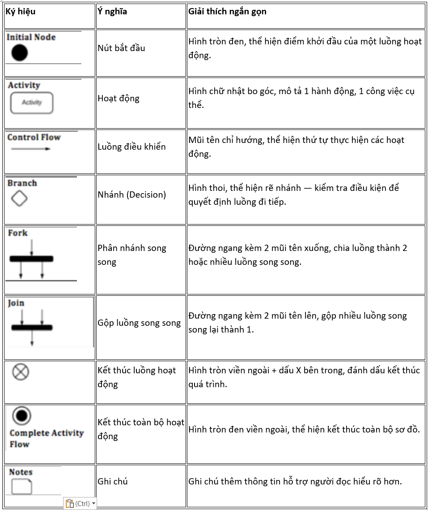
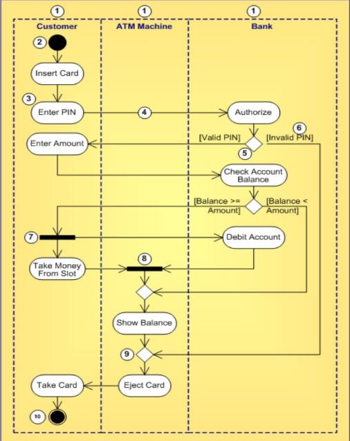

# Activity Diagram
- Activity Diagram là bản vẽ tập trung vào mô tả các hoạt động, luồng xử lý bên trong hệ thống.

- AD được sử dụng để mô tả các quy trình nghiệp vụ trong hệ thống, các luồng của một chức năng hoặc các hoạt động của một đối tượng.

- Cách vẽ:

- Ví dụ

# Lưu ý
- Một hoạt động bất kỳ đều phải có (duy nhất) 1 đầu vào và 1 đầu ra

- Tên hoạt động phải bắt đầu bằng động từ
    - Tốt nhất là tuân theo: Động + Danh (Chỉ đối tượng mà hoạt động tác động)

- Trong một sơ đồ, các hoạt động là duy nhất

- Hạn chế các đường cắt trong sơ đồ

- Các dòng trạng thái khi đi ra từ branch phải được chú thích đầy đủ