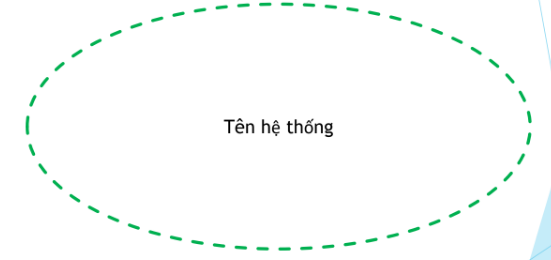

# Sơ đồ Use Case
## Use case
- Use Case là một tập hợp các bước hoặc hành động hệ thống thực hiện

- Những hành động này có mục đích giải quyết một nhu cầu cụ thể của người dùng hoặc hệ thống khác (tức actor).

- Sau khi hệ thống thực hiện các bước này, actor có thể nhìn thấy hoặc nhận được phản hồi cụ thể từ hệ thống.

- Mỗi Use Case đại diện cho một chức năng cụ thể mà hệ thống cung cấp

- Chức năng này phải có ý nghĩa đối với người dùng, phục vụ một mục đích rõ ràng mà người dùng mong muốn.

## Sơ đồ Use Case
- Là một mô hình trực quan thể hiện:
    - Các chức năng mà hệ thống cung cấp

    - Các actor (người dùng hoặc hệ thống khác) tương tác với hệ thống

    - Mối quan hệ giữa actor và Usecase

## Các bước thực hiện
- Bước 1: Xác định các Actor
    - Ai sử dụng hệ thống

    - Hệ thống nào tương tác với hệ thống

- Bước 2: Xác định Use Case
    - Actor sử dụng chức năng gì trong hệ thống

- Bước 3: Xác định các mối quan hệ
    - Giữa Actor với Usecase
    
    - Giữa Actor với Actor

    - Giữa Usecase với Usecase

## Viết đặc tả cho Use Case
- Cách 1:
    - Tên Use Case

    - Mã số Use Case

    - Mô tả tóm tắt

    - Các bước thực hiện

    - Điều kiện thoát

    - Yêu cầu đặc biệt (nếu có)

    - Yêu cầu trước khi thực hiện

    - Điều kiện sau khi thực hiện

- Cách 2:
    - Dùng các bản vẽ như Activity Diagram, Sequence Diagram để đặc tả Use case

## System Boundary

- Là đường biên xác định phạm vi của hệ thống, cho biết những gì thuộc về hệ thống và những gì nằm ngoài hệ thống.

- Các thành phần bên trong System Boundary là các chức năng, quy trình và dữ liệu thuộc hệ thống.

- Các đối tượng bên ngoài System Boundary (không thuộc hệ thống) nhưng có tương tác với hệ thống được gọi là Actor.

## Actor

### Khái niệm

- Actor là bất kỳ thực thể nào (con người, phần mềm, phần cứng) tương tác với hệ thống để thực hiện một chức năng nhất định.

- Actor không thuộc hệ thống, nhưng có vai trò kích hoạt hoặc nhận phản hồi từ hệ thống.

### Cách xác định Actor

- Ý 1

  - Một Actor có thể đại diện cho một cá nhân hoặc một nhóm người cùng thực hiện một vai trò.

  - Actor cũng có thể là một hệ thống khác tương tác với hệ thống chính thông qua API hoặc giao tiếp dữ liệu.

  - Ví dụ: trong hệ thống Quản lý đăng ký môn học, các Actor có thể là:

    - Sinh viên (Đăng ký môn học, xem thời khóa biểu)

    - Giảng viên (Xem danh sách sinh viên, nhập điểm)

    - Hệ thống thanh toán (kiểm tra và xác nhận học phí)

- Ý 2

  - Một người dùng có thể đóng nhiều vai trò khác nhau tùy vào quyền hạn của họ.

  - Ví dụ:
    - Một Giảng viên có thể vừa là Người nhập điểm, vừa là Cố vấn học tập kiểm tra lịch sử đăng ký của sinh viên.

- Ý 3

  - Nếu nhiều người có cùng quyền và thực hiện cùng chức năng, ta có thể gom họ vào một Actor chung.

  - Ví dụ: Trong hệ thống Quản lý thư viện, các Actor có thể là:

    - Người mượn sách (gồm sinh viên, giảng viên, nhân viên).

    - Nhân viên thư viện (quản lý kho sách, duyệt yêu cầu mượn).

- Ý 4

  - Mỗi nhóm người dùng (Actor) có thể sử dụng một hoặc nhiều chức năng trong hệ thống

  - Ví dụ:

    - Sinh viên có thể

      - Tra cứu sách

      - Đặt mượn sách

      - Gia hạn sách

    - Nhân viên thư viện có thể:

      - Quản lý sách

      - Xác nhận mượn sách

      - Kiểm tra vi phạm

- Ý 5

  - Một chức năng không nhất thiết chỉ dành cho một Actor mà có thể dùng chung.

  - Ví dụ:
    - Chức năng "Tra cứu tài liệu" có thể dùng bởi Sinh viên, Giảng viên, Nhân viên.

- Ý 6

  - Nếu nhiều nhóm người dùng có cùng vai trò, ta có thể gom lại và xem họ như một Actor chung.

  - Ví dụ:
    - Trong hệ thống Quản lý bán hàng, Nhân viên kho và Nhân viên bán hàng có thể cùng có quyền "Kiểm tra tồn kho".

- Ý 7

  - Khi thiết kế hệ thống, cần xác định rõ các Actor bằng cách phân tích luồng công việc thực tế.

  - Ví dụ: Trong hệ thống Quản lý bệnh viện, cần xem xét các Actor như:

    - Bệnh nhân (đặt lịch khám, tra cứu kết quả).

    - Bác sĩ (xem hồ sơ bệnh án, nhập kết quả khám).

    - Nhân viên kế toán (xử lý thanh toán, xuất hóa đơn).

    - Hệ thống bảo hiểm (kiểm tra quyền lợi bảo hiểm).

## Mối quan hệ giữa các Actor

- Trong một hệ thống, các Actor có thể có mối quan hệ với nhau. Các loại quan hệ bao gồm:

    - Quan hệ kế thừa (`<<generalization>>`):

        - Một Actor có thể kế thừa từ một Actor khác nếu Actor con có đầy đủ chức năng của Actor cha, đồng thời có thể bổ sung thêm chức năng riêng.
        
        - Ví dụ:

            - "Khách hàng VIP" kế thừa từ "Khách hàng thông thường" vì họ có tất cả các quyền của khách hàng thông thường nhưng có thêm ưu đãi đặc biệt.

## Mối quan hệ giữa các Use Case
- Các Use Case cũng có thể có mối quan hệ với nhau nhằm biểu diễn sự liên kết giữa các chức năng trong hệ thống.

### Quan hệ `<<generalization>>` giữa các Use Case
- Nếu nhiều Use Case có chức năng tương tự, chúng có thể được tổng quát hóa bằng một Use Case chung.

- Use Case tổng quát sẽ đại diện cho các chức năng chung, còn Use Case con có thể mở rộng hoặc tùy chỉnh thêm.

- Ví dụ:

    - Đăng nhập có thể có các Use Case con:

        - Đăng nhập qua số điện thoại
        
        - Đăng nhập qua email
        
    - Thanh toán có thể có các Use Case con:

        - Thanh toán qua ATM

        - Thanh toán qua thẻ quốc tế

        - Thanh toán qua ví điện tử

### Quan hệ `<<include>>` giữa các Use Case

-  Dùng để chia một Use Case lớn thành nhiều Use Case nhỏ để tái sử dụng hoặc làm cho hệ thống dễ quản lý hơn.

- Use Case tách riêng được gọi là Included Use Case và được sử dụng trong các Use Case khác.

- Tính bắt buộc: Một Use Case luôn luôn phải thực hiện Included Use Case khi được kích hoạt.

- Ví dụ:

    - Khi khách hàng đặt hàng, hệ thống sẽ tự động kiểm tra kho

    - Khi khách hàng đăng ký tài khoản, hệ thống sẽ gửi email xác nhận

    - Khi khách hàng thanh toán, hệ thống sẽ tính toán thuế

- Biểu diễn:

    - Đường nét đứt

    - Hình tam giác rỗng

    - Mũi tên trỏ về Use Case được sử dụng (Included Use Case)

    - Ghi `<<includes>>`

### Quan hệ `<<extends>>` giữa các Use Case

- Được sử dụng khi có một Use Case được tạo ra để bổ sung chức năng cho một Use Case có sẵn

- Dùng để mô tả các hành vi mở rộng, không bắt buộc phải có trong Use Case chính.

- Một Use Case chính có thể hoạt động độc lập mà không cần đến Use Case mở rộng.

- Ví dụ:

    - Khi khách hàng đặt hàng, hệ thống có thể đề xuất sản phẩm liên quan (không bắt buộc).

    - Khi khách hàng tìm kiếm sản phẩm, hệ thống có thể gợi ý tìm kiếm nâng cao (không bắt buộc).

    - Khi khách hàng hủy đơn hàng, hệ thống có thể đề xuất chương trình giảm giá (không bắt buộc).

- Biểu diễn:

    - Đường nét đứt

    - Hình tam giác rỗng

    - Mũi tên trỏ về Use Case chính

    - Ghi `<<extends>>`

## Mối quan hệ giữa Actor và Use Case
### Quan hệ Association (Kết nối trực tiếp)

- Mô tả sự tương tác trực tiếp giữa Actor và Use Case.

- Một Actor có thể tham gia vào nhiều Use Case, và một Use Case có thể được thực hiện bởi nhiều Actor.

- Ví dụ:

    - Khách hàng có thể tìm kiếm sản phẩm, đặt hàng, thanh toán.

    - Nhân viên giao hàng có thể xác nhận giao hàng.

    - Nhân viên kho có thể kiểm tra tồn kho.

### Quan hệ kế thừa (Generalization) giữa Actor và Use Case
- Nếu có nhiều Actor có chung một số chức năng nhưng có sự khác biệt, ta có thể tổng quát hóa chúng thành một Actor cha.

- Ví dụ:

    - Người dùng (User) có thể bao gồm Khách hàng và Quản trị viên.

    - Khách hàng VIP kế thừa từ Khách hàng thông thường nhưng có thêm các quyền lợi đặc biệt.

## Các lưu ý
#### Lưu ý 1
- Một actor phải được liên kết với ít nhất một use case.

- Một actor có thể liên kết với nhiều use case.

- Cách đặt tên:

    - Tên actor là danh từ

    - Tên usecase: động từ + danh từ (chỉ đối tượng/phạm vi tác động của UC)

#### Lưu ý 2
- Mỗi UC là chuỗi hành động để Actor đạt một tiêu nào đó.

- Tránh việc xác định những hành động cụ thể của
Actor.

#### Lưu ý 3
- Các UC trong cùng một sơ đồ phải cùng một mức độ với nhau.

#### Lưu ý 4
- Không nên vẽ quá nhiều UC trong một sơ đồ (tốt nhất là không quá 10 UC)

#### Lưu ý 6
- Tránh lặp lại các thao tác mà UC quản lý nào cũng có: thêm, xóa, sửa...

- SCRUB

#### Lưu ý 7
-  Kích cỡ các Use Case trong Diagram là phải như nhau, kể cả cha-con, lẫn các mối quan hệ Include. Tuy nhiên, Use Case có Extend sẽ được vẽ to hơn một chút.

-  Nhớ đánh dấu Use Case ID trong hình vẽ.

-  Các mối quan hệ không được chồng chéo lẫn nhau. Có thể vẽ 1 Actor ở 2 vị trí khác nhau để tránh các đường nối bắt chéo lên nhau.

-  Khi vẽ Use Case Diagram, tập trung vào câu hỏi What để tìm ra Use Case, tránh câu hỏi How.

